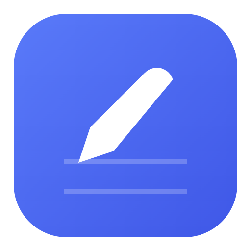

# FlatNotes

A smooth, pen-first Windows note-taking app - a Notability / GoodNotes / OneNote blend with a minimal, modern UI.

## Run

| What | How |
|---|---|
| Desktop app (portable) | `dist\FlatNotes.exe` - single file, no install |
| Desktop app (dev) | `npm start` |
| In a browser | serve `app/` (e.g. `python -m http.server 8765` inside `app/`) and open `http://localhost:8765` |

Notes are saved automatically (IndexedDB). The portable exe keeps its data per Windows user profile.

## Surface Pen

- **Pressure** controls stroke width (curve, minimum width and smoothing tunable in Settings).
- **Back-of-pen / barrel button** erases instantly - no tool switching, auto-returns to your pen.
- **Palm rejection**: fingers pan & pinch-zoom only (enable "Draw with touch" in Settings if you want finger inking).
- Low-latency ink via coalesced pointer events; committed strokes are rasterized per page for smooth 60fps pan/zoom.

## Tools

Pen · Highlighter (multiply blend, screen blend on dark paper) · Eraser (stroke / precise-split modes) · Lasso (move, duplicate, delete) · Text boxes · Shapes (line, arrow, box, oval - hold Shift to constrain) · **Textify** · **Voice**.

## Textify (local OCR)

Circle handwriting with the Textify tool (dashed circle with an "A") and it becomes an editable text item, undoable, with a "replace ink" toggle in the tool popover. Recognition runs **fully locally** on llama.cpp and the model is **loaded on demand**: the desktop app spawns `llama-server` on first use and unloads it after 10 idle minutes.

### Choosing a model

The Textify popover lists the recognition models. Picking a different one restarts the engine with it (all of them serve on the same port, so nothing else changes). Models that are not on disk are shown greyed out.

Measured on this machine (Snapdragon X Elite, CPU only) over five samples of 18 lines total, rendered in the Ink Free and Segoe Script handwriting fonts. Real ink is messier than a font, so treat this as a relative ranking rather than an absolute accuracy figure. CER is the character error rate against the ground truth, so lower is better:

| Model | CER | Recognition | Load | RAM |
|---|---|---|---|---|
| **GLM-OCR 0.9B** (default) | 0.006 | 20.8 s | 5.7 s | 2.2 GB |
| **Qwen3.5 0.8B** | 0 | 19.2 s | 4.6 s | 2.0 GB |
| Gemma 4 E4B | 0 | 38.2 s | 12.6 s | 6.0 GB |
| Qwen3.5 4B | 0 | 75.9 s | 8.6 s | 6.2 GB |

Qwen3.5 0.8B scored best overall: perfect on every sample, the fastest, and the smallest. GLM-OCR remains the default because it downloads itself and needs nothing preinstalled; its single error was a dropped `@`. The general vision models are prompted to transcribe rather than trained for it, and they are reasoning models, so requests send `enable_thinking: false`. Without that, Qwen spends its whole token budget in `reasoning_content` and returns nothing.

On real pen strokes drawn in the app, GLM-OCR, Qwen3.5 0.8B and Gemma 4 E4B all transcribed the same circled ink correctly, taking 2 to 3 seconds each.

The Gemma and Qwen entries read GGUF weights (model plus `mmproj` vision projector) from the LM Studio cache at `%USERPROFILE%\.cache\lm-studio\models\lmstudio-community\...`, so they appear only if you already have them there.

- One-time setup: `ocr\setup-ocr.ps1` (installs llama.cpp to `%LOCALAPPDATA%\FlatNotes\ocr`; GLM-OCR auto-downloads on first use).
- Browser mode: start the engine yourself, optionally with a model id: `ocr\start-ocr-engine.ps1 gemma-4-e4b`. Pick the same model in the popover so the matching prompt is used.
- Engine log: `%LOCALAPPDATA%\FlatNotes\ocr\engine.log`.
- RAM is freed again after the 10-minute idle unload. Every model is launched with `-c 8192 --parallel 1`; llama.cpp would otherwise reserve the model's full context across 4 slots, about 10 GB of KV cache for GLM-OCR alone.
- Why not Nemotron OCR v2: NVIDIA's smaller model (54-84 M params) is CUDA + Linux only, no CPU path, so it cannot run on this ARM64 Surface.

## Voice notes (local speech to text)

Pick the Voice tool, tap a spot on the page, and speak. A live transcript appears at that spot and grows as you talk; **Stop** commits it as an ordinary text item (editable, movable, one undo step), **Cancel** inserts nothing. Recording shows a pulsing indicator, elapsed time and an input level meter. The microphone is released on stop, cancel, Escape, tool switch, notebook switch and window close.

The engine is **sherpa-onnx** running **NVIDIA Parakeet TDT 0.6B v2** as an int8 ONNX export, fully locally on the CPU, loaded on demand and unloaded after 10 idle minutes exactly like Textify.

- One-time setup: `asr\setup-asr.ps1` (installs the win-arm64 sherpa-onnx build and the ~480 MB model to `%LOCALAPPDATA%\FlatNotes\asr`).
- Two models are selectable in the Voice popover. **v2** is English only and decodes at roughly 30x real time. **v3** covers 25 European languages at around 7x real time and is about 670 MB; install it with `asr\setup-asr.ps1 -Model sherpa-onnx-nemo-parakeet-tdt-0.6b-v3-int8`. Verified locally: v3 transcribed English, Spanish and French test clips correctly.
- Browser mode: start the engine yourself with `asr\start-asr-engine.ps1`; a browser cannot spawn it, so the tool says so instead of failing silently.
- Engine logs: `%LOCALAPPDATA%\FlatNotes\asr\engine.log` and `server.log`.
- Why sherpa-onnx and not NeMo: NeMo is CUDA and Linux oriented, the same reason Nemotron OCR v2 was rejected. sherpa-onnx ships real win-arm64 CPU binaries and a Parakeet TDT export, and decodes at roughly **30x real time** here (a 15 s buffer in ~0.42 s), which is what makes a live transcript possible.
- The live transcript re-decodes the whole buffer every 1.2 s rather than stitching chunks, so the text on screen never has seams. A slow decode simply delays the next one instead of queueing work up.

## OneNote import

**Settings → Import → Import from OneNote** copies the locally installed OneNote across. One OneNote section becomes one new FlatNotes notebook called `Notebook / Section`, page titles are kept, and handwriting arrives as **real vector ink**, not a picture: pen and highlighter strokes with their points, pressure, colour and width.

- One-time setup: `onenote\setup-onenote.ps1` (or `onenote\setup-onenote.cmd`). It compiles `onenote\FlatNotesOneNote.cs` with the in-box `csc.exe` into `%LOCALAPPDATA%\FlatNotes\onenote\bin`. Nothing is downloaded and nothing is registered.
- Why a compiled helper: `CreateObject("OneNote.Application")` works from a script here but every call after it fails `0x8002801D TYPE_E_LIBNOTREGISTERED`, because the typelib is registered Win32 only while Office is ClickToRun x64. Early binding against the `Microsoft.Office.Interop.OneNote` PIA in the GAC never loads the typelib.
- **Non-destructive**: the import only ever creates new notebooks. It never reads, rewrites or deletes an existing one, and the notebook you have open is untouched.
- Geometry: a OneNote page has no fixed size, and neither does a FlatNotes page, so **one OneNote page becomes exactly one page here**, however long it is. Each is scaled uniformly by `min(1, 820 / contentWidth)` (most pages come in at true size) and nothing is cut.
- Earlier imports did cut pages into sheets, which is what made long notes read badly. `app.mergeOneNoteSlices()` rejoins them in place for anyone holding such an import: the old importer wrote the page title onto the first sheet only, so an untitled page is a continuation of the one above it. That rule was checked against a real import before anything was rewritten (225 titled pages for 225 OneNote pages, 321 untitled continuations, no notebook with an untitled first page). Each continuation is dropped below the running content of its page, the seams are recorded on `page.merged`, and `doc.slicesMerged` makes a second run a no-op.
- **A rejoin is not the same as a true import, and the difference was measured.** Re-exporting three sections and comparing item by item: pages that had never been sliced matched a fresh export exactly (0 px), but rejoined pages were displaced by up to 667 px at the seams, with 1,725 of 3,975 items more than 2 px out. The old slicer discarded the empty runs it collapsed, so the original offsets are simply not recoverable from what was stored. **Re-importing is therefore the right fix whenever OneNote is still available**, and the rejoin is the fallback for when it is not.
- OneNote's own handwriting OCR is carried across on `page.ocrText` rather than drawn, so it does not double up with the ink.
- Not brought across: tables, tags, attachments, printouts, and images in formats a browser cannot draw (EMF). The import summary counts each of them.
- Measured on the real 4 notebooks / 37 sections / 225 pages here: 15m50s, **225 FlatNotes pages** (one per OneNote page, where the slicing importer produced 546), 99,968 strokes, 4.18 M points, 433 pictures, 2,709 text blocks, 0 pages lost, tallest page 57,000 px.

## Continuous pages

Pages have no bottom edge. Each one is as tall as its own content plus half a sheet of blank tail, so there is always somewhere below the last thing you wrote to keep going, and writing into that tail simply grows the page again. A page never gets shorter than one sheet, and it only shrinks once it is more than a step and a half too tall, so rubbing out your last line does not yank half a screen out from under the pen.

- Pages are **named**. A new one is numbered (`Page 3`) until you give it a name; right-click its thumbnail in the sidebar to rename it, and clear the field to go back to numbering. OneNote page titles arrive as names on import.
- The sidebar stays a grid of sheets: a thumbnail is the top of the page, with a `3×` badge when the page runs longer than that.
- The page indicator shows the name alongside the counter.
- **PDF** cuts a long page into as many sheets as its content needs, never emitting a sheet for the blank tail. **PNG** exports the whole page as one tall image, dropping the scale rather than cutting it if it would exceed 8000 px.
- **Two ways to read a notebook**, in Settings → Pages. **Continuous** is the strip you scroll straight through. **One page** shows only the page you are on, with nothing above or below it: the camera is fenced to that sheet, and scrolling or dragging past either end turns to the next one. `PageUp` / `PageDown` turn pages in both modes. Underneath, both are the same world: single-page view draws one sheet of it and keeps the camera inside that sheet, so which page is in focus stays a plain question of what the middle of the viewport is over. A page nobody can see cannot be inked on either, however far you zoom out.
- **Three ways to list them**, in Settings → Pages or from the buttons above the page list in the sidebar. **Big** is two sheets to a row, **Small** is three, and **List** is names and numbers with no previews, which is what a notebook of a couple of hundred pages wants.
- Rendering: a page is never baked as one bitmap. It is cut into bands of one sheet each, only the bands on screen are rastered, and the total pixels held are capped at 160 MB with the least recently drawn band evicted past that. Bands are drawn edge to edge on whole device pixels, and each band's paper is extended well past its own edges so the drop shadow is computed off-canvas: without that, every band boundary would show either a hairline gap or a doubly multiplied strip of highlighter. Measured on a 63,800 px page: median frame 16.7 ms, 95th percentile 17.1 ms, worst 19.6 ms while scrolling.

## Organization

Collections → notebooks → pages sidebar with live thumbnails in three densities, page templates (blank / lines / grid / dots), four paper colors, per-page style, duplicate/delete/rename pages (right-click a thumbnail or a list row), PNG export.

## Customization

Light/dark/system theme, 8 accent colors, choose which tools appear in the toolbar, pressure curve / smoothing sliders - all in Settings (sliders icon, top-right).

## Shortcuts

`P/H/E/L/T/S/X/V` tools · `Ctrl+Z / Ctrl+Y` undo/redo · `Ctrl+D` duplicate selection · `Del` delete selection · `Esc` deselect · `Ctrl+] / Ctrl+[` bring forward / send backward · `Ctrl+Shift+] / Ctrl+Shift+[` to front / to back · `PageUp / PageDown` previous/next page · `Space+drag` / middle-mouse pan · `Ctrl+scroll` zoom · `Ctrl+0` fit width · `Ctrl+S` save now

## Architecture

Zero-dependency vanilla ES modules (`app/`): `ink.js` (pressure-mapped variable-width outline geometry), `main.js` (engine: view transform, page raster caches, input, undo), `ui.js` (toolbar/popovers/sidebar/settings), `store.js` (IndexedDB). Electron shell in `electron/`. Build: `npm run dist` → `dist/FlatNotes.exe`.

## Where your notes live

Your notes are never stored in this repository. The checkout holds code only, and the app writes everything it owns to per-user directories outside it:

| What | Where |
|---|---|
| Every notebook, page and image (IndexedDB) | `%APPDATA%\FlatNotes` |
| Settings, collections, last camera position | same IndexedDB store |
| Window size and position | `%APPDATA%\FlatNotes\window-state.json` |
| OneNote import staging (a full copy of the imported notes, cleared after import) | `%APPDATA%\FlatNotes\onenote-import` |
| OCR and speech models, engine logs | `%LOCALAPPDATA%\FlatNotes\{ocr,asr,onenote}` |

Nothing is sent anywhere. Recognition and transcription run locally against a llama.cpp or sherpa-onnx server bound to `127.0.0.1`, spawned on demand and unloaded after ten idle minutes. The Electron shell loads no remote content and grants no permission except the microphone, which only the Voice tool asks for.

To wipe everything the app has stored, delete `%APPDATA%\FlatNotes` and `%LOCALAPPDATA%\FlatNotes`.
